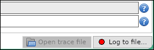
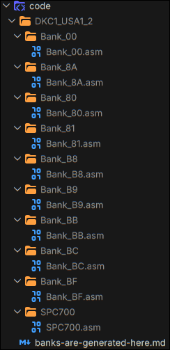

# SNES Assembly Extractor 

This tool converts [Mesen](https://github.com/SourMesen/Mesen2) emulator `.txt` log traces, into structured `.asm` files.

It handles code repetitions and SPC700 audio code.

This was developed using [Mesen](https://github.com/SourMesen/Mesen2), but I don't guarantee it will for other emulators.

> [!IMPORTANT]
> **No rom, assets, nor extracted code in this repository**.

## How to create a game code log trace ?

### **1. Code capture from Mesen-S (or any emulator)**

On the toolbar at the top, select `Trace Logger` :


### **Make sure you got these exact settings for better compatibility :**


### **3. Log to a `.txt` file**

Select `Log to file...` and save it as a `.txt` file anywhere you want :



### **4. Start trace creation**

Press play button on the upper left to start trace creation :


### **5. Place logs in `this-project/traces` :**


## How to use it ?

```bash
bash run.sh
```

This will reads **all** `.txt` from `traces/`, delete double code, and generate `.asm` files in `code/{FILE_NAME}`.

Here is a result example with a trace log named `DKC1_USA1_2.txt` :


