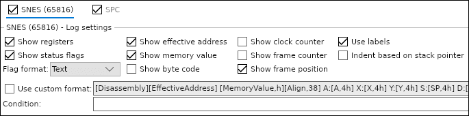
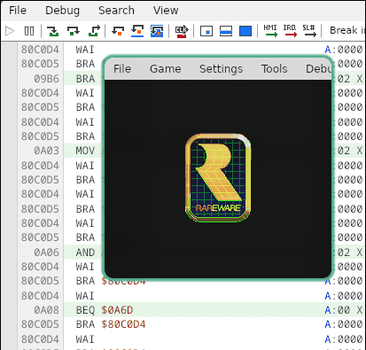

# SNES Assembly Extractor 

This tool converts [Mesen](https://github.com/SourMesen/Mesen2) emulator `.txt` log traces, into structured `.asm` files.

It handles code repetitions and SPC700 audio code.

This was developed using [Mesen](https://github.com/SourMesen/Mesen2), but I don't guarantee if it works for other emulators. Contact me if it does.

Still in active developpement and might not work for now.

> [!IMPORTANT]
> **No rom, img, nor extracted code in this repository**.

## How to create a game code trace log ?

### **1. Code capture using Mesen**

On the toolbar at the top, select `Trace Logger` :


Make sure you got these exact settings for better compatibility :



### **3. Log to a `.txt` file**

Select `Log to file...` :


Save it as a `.txt` file in `this-project/traces` :


### **4. Start trace log creation**

Press play button on the upper left to start trace creation :



> [!WARNING]
> Trace logging can quickly generate VERY large .txt file, a file from a 20min session can take up to ~60 Go !
> Make sure you got large free space.

## How to use it ?

```bash
bash run.sh
```

This will reads **all** `.txt` from `traces/`, delete double code, and generate `.asm` files in `result/{FILE_NAME}`.

> [!NOTE]
> This process can be long depending on the trace files size.

Here is a result example with a trace log named `DKC1_USA1_2.txt` :

